# AI Agents Documentation

This document describes the AI-powered agents in SAMVIT HRMS, including the HR Assistant (Pydantic AI) and the Leave Approval Workflow (LangGraph).

## Table of Contents

- [Overview](#overview)
- [Architecture](#architecture)
- [HR Assistant Agent](#hr-assistant-agent)
  - [Capabilities](#capabilities)
  - [Tools](#tools)
  - [Response Schema](#response-schema)
  - [Conversation Memory](#conversation-memory)
- [Leave Approval Workflow](#leave-approval-workflow)
  - [Workflow Diagram](#workflow-diagram)
  - [State Machine](#state-machine)
  - [Workflow States](#workflow-states)
  - [Validation Rules](#validation-rules)
  - [Business Rules](#business-rules)
- [Integration](#integration)
- [API Reference](#api-reference)
- [Configuration](#configuration)

---

## Overview

SAMVIT HRMS uses two complementary AI frameworks:

| Framework | Purpose | Use Case |
|-----------|---------|----------|
| **Pydantic AI** | Conversational AI agent | Natural language HR queries, tool calling |
| **LangGraph** | Stateful workflow engine | Multi-step approval processes with human-in-the-loop |

```mermaid
flowchart TB
    subgraph "User Interface"
        U[👤 Employee]
    end

    subgraph "AI Layer"
        A[🤖 HR Agent<br/>Pydantic AI]
        W[📋 Leave Workflow<br/>LangGraph]
    end

    subgraph "Data Layer"
        DB[(PostgreSQL)]
        CP[(Checkpoint Store)]
    end

    U -->|Chat Message| A
    A -->|Tool Calls| DB
    A -->|apply_leave| W
    W -->|State Persistence| CP
    W -->|DB Operations| DB
    A -->|Response| U
```



---

## Architecture

### Technology Stack

- **Pydantic AI** v1.24.0+ - Type-safe agent framework with structured outputs
- **LangGraph** v1.0.4 - Graph-based workflow orchestration
- **AsyncPostgresSaver** - Persistent checkpoint storage for workflows
- **SQLAlchemy 2.0** - Async database access

### Key Design Patterns

1. **Singleton Agent** - `@cache` decorator for thread-safe lazy initialization
2. **Closure-based Context** - Database session injected via factory pattern for LangGraph nodes
3. **TypedDict State** - LangGraph-recommended state schema for serialization
4. **Structured Responses** - Pydantic models for all tool outputs

---

## HR Assistant Agent

The HR Assistant is a conversational AI that helps employees with HR-related queries using natural language.

### Capabilities

| Capability | Description | Example Query |
|------------|-------------|---------------|
| **Leave Balance** | Check available leave days by type | "What's my leave balance?" |
| **Apply Leave** | Submit leave requests | "Apply for casual leave Dec 1-5" |
| **Attendance** | View monthly attendance summary | "Show my attendance for November" |
| **Payslip** | Get salary information | "What was my salary last month?" |
| **Holidays** | View upcoming company holidays | "When's the next holiday?" |
| **Team Leave** | Check who's on leave | "Who's on leave today?" |

### Tools

The agent has access to 6 tools:

#### 1. `get_leave_balance`

Returns the employee's leave balances across all leave types.

**Response Schema:**
```python
class LeaveBalanceResponse:
    employee_name: str
    balances: list[LeaveBalanceItem]  # leave_type, total, used, pending, available
    message: str
```

#### 2. `get_attendance_summary`

Returns attendance statistics for a given month.

**Parameters:**
- `month` (optional): Target month (1-12), defaults to current
- `year` (optional): Target year, defaults to current

**Response Schema:**
```python
class AttendanceSummaryResponse:
    month: int
    year: int
    present_days: int
    absent_days: int
    leave_days: int
    half_days: int
    message: str
```

#### 3. `get_upcoming_holidays`

Returns upcoming company holidays.

**Parameters:**
- `count` (optional): Number of holidays to return, defaults to 5

**Response Schema:**
```python
class HolidaysResponse:
    holidays: list[HolidayItem]  # name, date, is_optional
    message: str
```

#### 4. `get_payslip`

Returns payslip information for a given month.

**Parameters:**
- `month` (optional): Target month (1-12), defaults to current
- `year` (optional): Target year, defaults to current

**Response Schema:**
```python
class PayslipResponse:
    month: int
    year: int
    gross_earnings: float
    total_deductions: float
    net_pay: float
    status: str
    message: str
```

#### 5. `get_team_on_leave`

Returns team members on leave for a given date.

**Parameters:**
- `target_date` (optional): Date in YYYY-MM-DD format, defaults to today

**Response Schema:**
```python
class TeamLeaveResponse:
    date: str
    employees: list[str]
    count: int
    message: str
```

#### 6. `apply_leave`

Submits a leave request through the LangGraph workflow.

**Parameters:**
- `leave_type`: Type of leave (e.g., "Casual", "Sick", "Earned")
- `start_date`: Start date in YYYY-MM-DD format
- `end_date`: End date in YYYY-MM-DD format
- `reason`: Reason for leave
- `start_day_type` (optional): "full", "first_half", or "second_half"
- `end_day_type` (optional): "full", "first_half", or "second_half"

**Response Schema:**
```python
class ApplyLeaveResponse:
    success: bool
    request_id: str | None
    thread_id: str | None  # For tracking workflow
    leave_type: str
    start_date: str
    end_date: str
    total_days: float
    status: str
    manager_name: str | None
    message: str
    validation_errors: list[str]
```

### Response Schema

All agent responses follow a unified structure:

```python
class HRAgentResponse:
    message: str          # Natural language response
    data: dict | None     # Structured data (optional)
    follow_up_questions: list[str]  # Suggested next questions
```

### Conversation Memory

The agent supports multi-turn conversations with message history:

```python
# Example usage with conversation history
response = await process_message(
    message="Apply for leave next week",
    session=db_session,
    tenant_id="tenant_123",
    employee_id="emp_456",
    user_id="user_789",
    message_history=[
        {"role": "user", "content": "What's my leave balance?"},
        {"role": "assistant", "content": "You have 10 casual leave days..."},
    ]
)
```

---

## Leave Approval Workflow

The Leave Approval Workflow is a LangGraph-based state machine that handles the complete leave request lifecycle with human-in-the-loop approvals.

### Integration with HR Agent

```mermaid
flowchart LR
    subgraph Chat Interface
        U[👤 Employee]
        A[🤖 HR Agent<br/>Pydantic AI]
    end

    subgraph Workflow Engine
        W[📋 Leave Workflow<br/>LangGraph]
    end

    subgraph Approvers
        M[👔 Manager]
        H[🏢 HR Team]
    end

    U -->|"I want to apply for<br/>leave Dec 1-5"| A
    A -->|apply_leave tool| W
    W -->|Validation + Create| W
    W -.->|Notification| M
    M -->|Approve/Reject| W
    W -.->|If >5 days| H
    H -->|Approve/Reject| W
    W -->|Status Update| A
    A -->|"Your leave is approved!"| U
```



**Two ways to apply for leave:**
1. **Chat** (Recommended): Talk to HR Agent → `"Apply for casual leave from Dec 1 to Dec 5 for family vacation"`
2. **Direct API**: Call `POST /api/v1/ai/leave-workflow/start` (for programmatic access)

### Workflow Diagram

```mermaid
flowchart TD
    subgraph Employee Action
        A[🧑‍💼 Employee Submits<br/>Leave Request]
    end

    subgraph Validation Phase
        B{Validate Request}
        B1[Check Employee Exists]
        B2[Check Policy Rules]
        B3[Check Leave Balance]
        B4[Check Overlapping Leaves]
        B5[Check Advance Notice]
    end

    subgraph Request Creation
        C[📝 Create Leave Request<br/>in Database]
        C1[Set Status: PENDING]
        C2[Update Pending Balance]
    end

    subgraph Manager Approval
        D[⏳ Await Manager<br/>Approval]
        E{Manager<br/>Decision}
    end

    subgraph HR Review
        F[⏳ Await HR<br/>Review]
        G{HR<br/>Decision}
    end

    subgraph Outcomes
        H[✅ APPROVED<br/>Balance Updated]
        I[❌ REJECTED<br/>Balance Restored]
        J[⚠️ VALIDATION<br/>FAILED]
    end

    A --> B
    B --> B1 --> B2 --> B3 --> B4 --> B5
    B5 -->|All Passed| C
    B5 -->|Any Failed| J

    C --> C1 --> C2 --> D

    D -->|Human Input| E
    E -->|Rejected| I
    E -->|Approved<br/>≤5 days| H
    E -->|Approved<br/>>5 days| F

    F -->|Human Input| G
    G -->|Approved| H
    G -->|Rejected| I

    style A fill:#e1f5fe
    style H fill:#c8e6c9
    style I fill:#ffcdd2
    style J fill:#fff3e0
    style D fill:#fff9c4
    style F fill:#fff9c4
```



### State Machine


### Workflow States

| State | Description |
|-------|-------------|
| `PENDING_VALIDATION` | Initial state, request being validated |
| `VALIDATION_FAILED` | Validation failed (insufficient balance, policy violation, etc.) |
| `PENDING_MANAGER_APPROVAL` | Awaiting manager's decision |
| `PENDING_HR_REVIEW` | Awaiting HR review (for leaves > 5 days) |
| `APPROVED` | Leave request approved, balance updated |
| `REJECTED` | Leave request rejected |
| `CANCELLED` | Leave request cancelled by employee |

### Validation Rules

The workflow validates the following before creating a leave request:

| Rule | Description |
|------|-------------|
| **Employee Active** | Employee must exist and be active |
| **Policy Active** | Leave policy must be active |
| **Sufficient Balance** | Available balance ≥ requested days |
| **Advance Notice** | Days in advance ≥ policy requirement |
| **Min/Max Days** | Request within policy limits |
| **No Overlap** | No existing pending/approved leaves for same dates |
| **Excludes Holidays** | Calculation excludes company holidays |
| **Excludes Weekends** | Calculation excludes Saturdays and Sundays |

### Business Rules

#### HR Review Trigger
- Leaves **> 5 days** require HR review after manager approval
- Configurable via `HR_REVIEW_THRESHOLD_DAYS` constant
- HR can approve or reject with remarks

#### Balance Updates
- **On Submit**: Days added to `pending` balance
- **On Approve**: Days moved from `pending` to `used`
- **On Reject**: Days removed from `pending`

### Sequence Diagram

```mermaid
sequenceDiagram
    participant E as Employee
    participant API as API Endpoint
    participant WF as Workflow Engine
    participant DB as Database
    participant M as Manager
    participant HR as HR Team

    E->>API: POST /leave-workflow/start
    API->>WF: Start Workflow
    WF->>DB: Validate Employee & Policy
    WF->>DB: Check Leave Balance
    WF->>DB: Check Overlapping Leaves

    alt Validation Failed
        WF-->>API: Return Errors
        API-->>E: 400 Validation Failed
    else Validation Passed
        WF->>DB: Create Leave Request (PENDING)
        WF->>DB: Add to Pending Balance
        WF-->>API: Return thread_id
        API-->>E: 201 Created (awaiting approval)
    end

    Note over WF: Workflow Paused<br/>(Human-in-the-loop)

    M->>API: POST /leave-workflow/manager/decide
    API->>WF: Resume Workflow
    WF->>WF: Process Decision

    alt Manager Rejected
        WF->>DB: Update Status: REJECTED
        WF->>DB: Remove from Pending Balance
        WF-->>API: Workflow Complete
        API-->>M: Leave Rejected
    else Manager Approved (≤5 days)
        WF->>DB: Update Status: APPROVED
        WF->>DB: Move Pending → Used
        WF-->>API: Workflow Complete
        API-->>M: Leave Approved
    else Manager Approved (>5 days)
        WF-->>API: Awaiting HR Review
        API-->>M: Forwarded to HR

        Note over WF: Workflow Paused<br/>(HR Review)

        HR->>API: POST /leave-workflow/hr/decide
        API->>WF: Resume Workflow

        alt HR Approved
            WF->>DB: Update Status: APPROVED
            WF->>DB: Move Pending → Used
            WF-->>API: Workflow Complete
            API-->>HR: Leave Approved
        else HR Rejected
            WF->>DB: Update Status: REJECTED
            WF->>DB: Remove from Pending Balance
            WF-->>API: Workflow Complete
            API-->>HR: Leave Rejected
        end
    end
```



---

## Integration

### Chat API

```http
POST /api/v1/ai/chat
Content-Type: application/json
Authorization: Bearer <token>
Host: <tenant>.samvit.bhanu.dev

{
  "message": "What's my leave balance?",
  "conversation_id": "optional-uuid-for-multi-turn"
}
```

**Response:**
```json
{
  "message": "You have 15.0 total leave days available across all types.",
  "data": {
    "employee_name": "John Doe",
    "balances": [
      {
        "leave_type": "Casual Leave",
        "total_days": 12,
        "used_days": 2,
        "pending_days": 0,
        "available_days": 10
      },
      {
        "leave_type": "Sick Leave",
        "total_days": 6,
        "used_days": 1,
        "pending_days": 0,
        "available_days": 5
      }
    ]
  },
  "follow_up_questions": [
    "Would you like to apply for leave?",
    "When are the upcoming holidays?"
  ]
}
```

### Leave Workflow API

#### Start Leave Request

```http
POST /api/v1/ai/leave-workflow/start
```

**Request Body:**
```json
{
  "policy_id": "uuid",
  "start_date": "2025-12-01",
  "end_date": "2025-12-05",
  "reason": "Family vacation",
  "start_day_type": "full",
  "end_day_type": "full"
}
```

**Response:**
```json
{
  "thread_id": "leave_tenant123_emp456_1732900000",
  "status": "pending_manager_approval",
  "message": "Leave request submitted. Awaiting approval from John Doe.",
  "data": {
    "request_id": "uuid",
    "total_days": 5.0,
    "policy_name": "Earned Leave"
  }
}
```

#### Manager Decision

```http
POST /api/v1/ai/leave-workflow/manager/decide
```

**Request Body:**
```json
{
  "thread_id": "leave_tenant123_emp456_1732900000",
  "decision": "approved",
  "remarks": "Approved. Enjoy your vacation!"
}
```

#### HR Decision

```http
POST /api/v1/ai/leave-workflow/hr/decide
```

**Request Body:**
```json
{
  "thread_id": "leave_tenant123_emp456_1732900000",
  "decision": "approved",
  "remarks": "Approved after reviewing team coverage."
}
```

#### Get Workflow Status

```http
GET /api/v1/ai/leave-workflow/status/{thread_id}
```

---

## Configuration

### Environment Variables

| Variable | Description | Default |
|----------|-------------|---------|
| `AI_MODEL` | LLM model identifier | `openai:gpt-4o-mini` |
| `OPENAI_API_KEY` | OpenAI API key | Required |
| `DATABASE_URL` | PostgreSQL connection (used for checkpoints) | Required |

### Constants

| Constant | Location | Value | Description |
|----------|----------|-------|-------------|
| `HR_REVIEW_THRESHOLD_DAYS` | `leave_workflow.py` | `5` | Leaves > this need HR review |

---

## File Structure

```
backend/app/ai/agents/
├── __init__.py
├── base.py                    # Base agent interface
├── router.py                  # AI API router
├── pydantic_ai/
│   ├── __init__.py
│   ├── hr_agent.py            # HR Assistant implementation (~750 lines)
│   └── hr_agent.md            # Agent-specific docs
└── langgraph/
    ├── __init__.py
    ├── leave_workflow.py      # Workflow implementation (~600 lines)
    ├── leave_workflow.md      # Workflow-specific docs
    └── routes.py              # Workflow API endpoints (~300 lines)
```

---

## LangGraph Features Used

| Feature | Usage |
|---------|-------|
| **StateGraph** | Defines workflow as a directed graph |
| **TypedDict State** | Clean serializable state schema |
| **AsyncPostgresSaver** | Persistent checkpoints (production-ready) |
| **interrupt_before** | Pauses at `process_manager` and `process_hr` nodes |
| **Conditional Edges** | Routes based on validation/decisions |
| **Closure Pattern** | Context injection for database access |

---

## Production Checklist

| Feature | Status |
|---------|--------|
| Persistent checkpoints | ✅ AsyncPostgresSaver (PostgreSQL) |
| TypedDict state | ✅ Proper serialization |
| Structured responses | ✅ Pydantic models |
| Balance rollback on reject | ✅ `_restore_pending_balance` |
| Thread-safe agent | ✅ `@cache` decorator |
| Conversation memory | ✅ `message_history` parameter |
| Closure-based context | ✅ `create_workflow_nodes()` factory |
| Cached workflow runner | ✅ Singleton pattern |

---

## Future Enhancements

1. **Email Notifications** - Notify stakeholders at each workflow step
2. **Delegation** - Allow managers to delegate approval authority
3. **Auto-Approval** - Auto-approve for certain leave types/durations
4. **Escalation** - Escalate if manager doesn't respond in X days
5. **Cancel/Withdraw** - Allow employees to cancel pending requests
6. **Analytics** - Track agent usage and response quality
7. **More Tools** - Add policy lookup, org chart navigation, etc.

---

*Last updated: November 2025*
